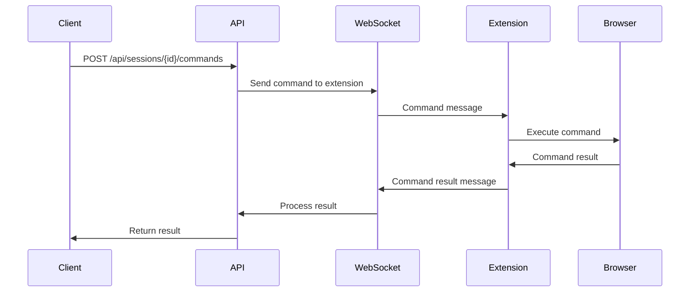

# WebSocket Protocol Documentation

## Overview

The Browser Automation Service uses WebSocket connections to communicate in real-time with browser extensions. This enables bidirectional communication for command execution and status updates.

**WebSocket URL**: `ws://localhost:3010/ws`

## Connection Setup

### Connecting to WebSocket

To connect to the WebSocket server, append the session ID as a query parameter:

```
ws://localhost:3010/ws?sessionId=a1b2c3d4-e5f6-7890-abcd-ef1234567890
```

### Connection Verification

The server verifies connections by:
1. Checking the `sessionId` query parameter
2. Validating that the session exists
3. Optionally checking the origin header (in production)

### Connection Lifecycle

1. **Connection Established**: Client connects with valid session ID
2. **Registration**: Server sends registration confirmation
3. **Active Communication**: Bidirectional message exchange
4. **Heartbeat**: Periodic ping/pong for connection health
5. **Disconnection**: Clean closure or error handling

## Message Format

All messages are JSON objects with a `type` field identifying the message purpose.

### Basic Message Structure
```json
{
  "type": "message_type",
  "timestamp": "2024-01-15T10:00:00Z",
  "data": { /* message-specific data */ }
}
```

## Message Types

### Extension → Service Messages

#### Registration Confirmation
Sent automatically when connection is established (not sent by extension).

#### Ping
Heartbeat message to maintain connection.

```json
{
  "type": "ping"
}
```

#### Command Result
Reports the result of an executed command.

```json
{
  "type": "command_result",
  "commandId": "cmd_123",
  "success": true,
  "result": {
    "url": "https://example.com",
    "title": "Example Domain",
    "timestamp": "2024-01-15T10:00:00Z"
  },
  "error": null
}
```

**Error Example:**
```json
{
  "type": "command_result",
  "commandId": "cmd_456",
  "success": false,
  "result": null,
  "error": "Element not found: button#submit"
}
```

#### Client Error
Reports errors that occur in the extension.

```json
{
  "type": "error",
  "error": "Failed to execute script: Syntax error",
  "context": {
    "commandId": "cmd_789",
    "url": "https://example.com"
  }
}
```

#### Status Update
Updates the session status from the extension side.

```json
{
  "type": "status_update",
  "status": "ready",
  "metadata": {
    "tabCount": 3,
    "activeTabUrl": "https://example.com"
  }
}
```

### Service → Extension Messages

#### Registration Confirmation
Confirms successful connection and registration.

```json
{
  "type": "registered",
  "sessionId": "a1b2c3d4-e5f6-7890-abcd-ef1234567890",
  "timestamp": "2024-01-15T10:00:00Z"
}
```

#### Command Execution
Instructs the extension to execute a command.

```json
{
  "type": "command",
  "id": "cmd_123",
  "command": {
    "type": "navigate",
    "payload": {
      "url": "https://example.com"
    },
    "timeout": 30000
  }
}
```

#### Command Cancellation
Instructs the extension to cancel a pending command.

```json
{
  "type": "cancel_command",
  "commandId": "cmd_123"
}
```

#### Pong
Heartbeat response to ping.

```json
{
  "type": "pong"
}
```

#### Service Error
Reports errors from the service side.

```json
{
  "type": "error",
  "error": "Invalid command format",
  "code": "INVALID_COMMAND"
}
```

## Command Execution Flow

1. **Command Request**: API receives command via REST endpoint
2. **Command Queue**: Command added to session queue
3. **WebSocket Send**: Command sent to extension via WebSocket
4. **Extension Execute**: Extension executes command in browser
5. **Result Send**: Extension sends result back via WebSocket
6. **API Response**: Original REST API call receives response



## Heartbeat Mechanism

The service implements a heartbeat mechanism to detect disconnected clients:

1. **Server Ping**: Service sends ping every 30 seconds (configurable)
2. **Client Pong**: Extension responds with pong
3. **Connection Check**: Missing pongs trigger connection termination
4. **Reconnection**: Extension can attempt automatic reconnection

### Heartbeat Configuration
```env
WS_HEARTBEAT_INTERVAL=30000  # 30 seconds
WS_CONNECTION_TIMEOUT=60000  # 60 seconds
```

## Error Handling

### Connection Errors
- **Invalid Session**: Connection rejected with close code 1000
- **Network Error**: Connection dropped, extension should retry
- **Server Shutdown**: Graceful close with code 1000

### Command Errors
- **Timeout**: Command not completed within timeout period
- **Execution Error**: Browser-side error during command execution
- **Invalid Command**: Malformed or unsupported command type

### Error Codes
- `1000`: Normal closure
- `1001`: Going away (server shutdown)
- `1002`: Protocol error
- `1003`: Unsupported data type
- `1007`: Invalid data
- `1011`: Server error

## Security Considerations

### Origin Validation
In production, implement origin header validation:

```javascript
verifyClient: (info) => {
  const allowedOrigins = ['chrome-extension://your-extension-id'];
  return allowedOrigins.includes(info.origin);
}
```

### Message Validation
All incoming messages should be validated:
- JSON format validation
- Required field validation
- Type checking
- Payload sanitization

### Rate Limiting
Implement rate limiting for WebSocket messages:
- Maximum messages per second
- Command execution throttling
- Connection attempt limiting

## Browser Extension Implementation

### Connection Management
```javascript
class WebSocketClient {
  constructor(sessionId, serverUrl) {
    this.sessionId = sessionId;
    this.serverUrl = serverUrl;
    this.ws = null;
    this.reconnectAttempts = 0;
  }

  connect() {
    const url = `${this.serverUrl}?sessionId=${this.sessionId}`;
    this.ws = new WebSocket(url);
    
    this.ws.onopen = this.handleOpen.bind(this);
    this.ws.onmessage = this.handleMessage.bind(this);
    this.ws.onclose = this.handleClose.bind(this);
    this.ws.onerror = this.handleError.bind(this);
  }

  sendMessage(message) {
    if (this.ws && this.ws.readyState === WebSocket.OPEN) {
      this.ws.send(JSON.stringify(message));
    }
  }
}
```

### Message Handling
```javascript
handleMessage(event) {
  try {
    const message = JSON.parse(event.data);
    
    switch (message.type) {
      case 'command':
        this.executeCommand(message.id, message.command);
        break;
      case 'cancel_command':
        this.cancelCommand(message.commandId);
        break;
      case 'pong':
        // Heartbeat response
        break;
    }
  } catch (error) {
    console.error('Failed to handle message:', error);
  }
}
```

## Testing WebSocket Connection

### Using Browser Console
```javascript
// Connect to WebSocket
const ws = new WebSocket('ws://localhost:3010/ws?sessionId=your-session-id');

// Send ping
ws.send(JSON.stringify({ type: 'ping' }));

// Send command result
ws.send(JSON.stringify({
  type: 'command_result',
  commandId: 'cmd_123',
  success: true,
  result: { test: 'data' }
}));
```

### Using Node.js WebSocket Client
```javascript
const WebSocket = require('ws');

const ws = new WebSocket('ws://localhost:3010/ws?sessionId=test-session');

ws.on('open', () => {
  console.log('Connected');
  ws.send(JSON.stringify({ type: 'ping' }));
});

ws.on('message', (data) => {
  console.log('Received:', JSON.parse(data));
});
```

## Troubleshooting

### Common Issues

1. **Connection Refused**
   - Check if service is running
   - Verify port (default: 3010)
   - Check firewall settings

2. **Invalid Session Error**
   - Ensure session exists
   - Check session ID format
   - Verify session hasn't expired

3. **Command Timeout**
   - Check command payload format
   - Verify browser extension is responsive
   - Increase timeout if needed

4. **Frequent Disconnections**
   - Check network stability
   - Verify heartbeat responses
   - Review connection error logs

### Debug Logging
Enable debug logging in extension:

```javascript
const DEBUG = true;

function log(message, data) {
  if (DEBUG) {
    console.log(`[WebSocket] ${message}`, data);
  }
}
```
